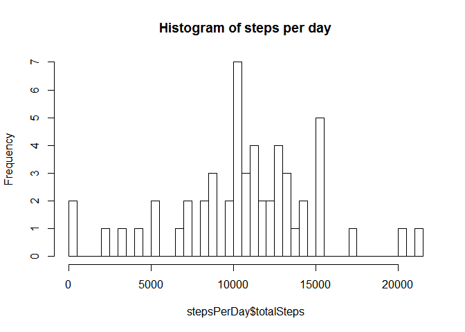
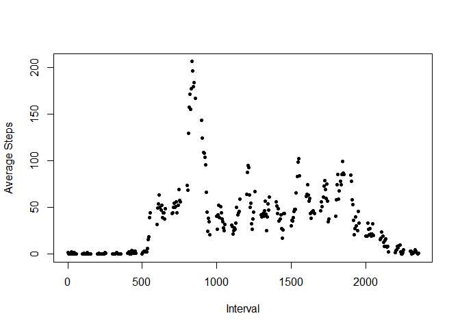
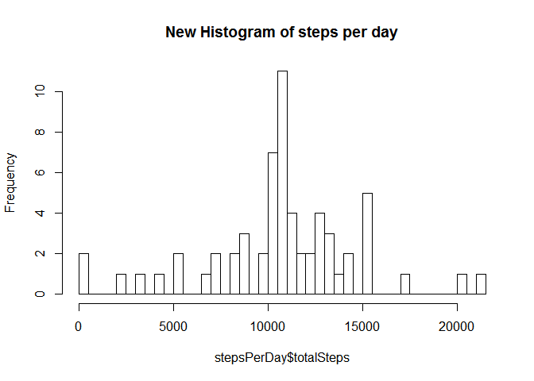
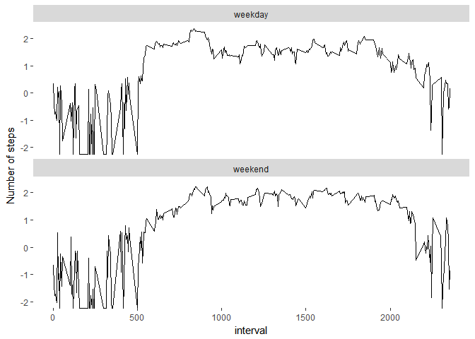

```r
library(dplyr)
library(ggplot2)
```


## Loading and preprocessing the data


```r
zipfile <- as.character(unzip("activity.zip", list = TRUE)$Name)
activity <- read.csv(unz("activity.zip", "activity.csv"))
activity$date <- as.Date(activity$date, "%Y-%m-%d")
```


## What is mean total number of steps taken per day?


```r
stepsPerDay <- group_by(activity, date) %>% summarise(totalSteps = sum(steps))

hist(stepsPerDay$totalSteps, breaks=nrow(stepsPerDay), main="Histogram of steps per day")
```

<!-- -->

### Mean & Median of the total number of steps taken per day

**Reviewers: There was qutie some discussion about this in the forums also.
My udnerstanding is we need to provide the mean and median based on the total steps per day.

If the requirement is to print the mean & median day wise, I do have the code for that also:
I would add meanSteps = mean(steps) & medianSteps = median(steps) in the summarise command above
and print the results of these 2 variables by date (I can use xtable to print the table for this) **


```r
summary(stepsPerDay$totalSteps)
```

```
##    Min. 1st Qu.  Median    Mean 3rd Qu.    Max.    NA's 
##      41    8841   10765   10766   13294   21194       8
```
 

## What is the average daily activity pattern?

```r
dailyPattern <- aggregate(activity$steps, by=list(activity$interval), FUN=mean, na.rm=TRUE)

names(dailyPattern) <- c("interval", "avgSteps")
plot(dailyPattern$interval, dailyPattern$avgSteps, pch=20, 
      xlab="Interval", ylab="Average Steps")
```

<!-- -->

```r
maxInterval <- dailyPattern$interval[which(dailyPattern$avgSteps == max(dailyPattern$avgSteps))]
```

The interval with maximum # of average steps across days is 835

## Imputing missing values

```r
noActivity <- is.na(activity$steps)
```

There are 2304 records with missing steps

Update the missing values with the mean of the steps for that particular interval across days


```r
stepsCorrected <- sapply(seq_along(activity$steps), function(x) if (is.na(activity$steps[x]))
                                        return(dailyPattern$avgSteps[dailyPattern$interval == activity$interval[x]])
									 else
										return(activity$steps[x]))
															
										
newActivity <- activity[, c("date", "interval")]

newActivity <- cbind(newActivity, stepsCorrected)

stepsPerDay <- group_by(newActivity, date) %>% summarise(totalSteps = sum(stepsCorrected))
hist(stepsPerDay$totalSteps, breaks=nrow(stepsPerDay), main="New Histogram of steps per day")
```

<!-- -->

### New Mean & Median of the total number of steps taken per day


```r
summary(stepsPerDay$totalSteps)
```

```
##    Min. 1st Qu.  Median    Mean 3rd Qu.    Max. 
##      41    9819   10766   10766   12811   21194
```

## Are there differences in activity patterns between weekdays and weekends?

```r
dateClassification <- sapply(newActivity$date, 
                             function(x) {                                                     
                                     if(grepl("^S", weekdays(x))) return ("weekend")
												            else return("weekday")
                                        })
												 
newActivity$dtClass <- factor(dateClassification, levels=c("weekday","weekend"))

dtClassActivity <- aggregate(stepsCorrected ~ dtClass + interval, newActivity, mean)

mp <- ggplot(dtClassActivity, aes(interval, log10(stepsCorrected))) + 
      geom_line() + facet_wrap(~dtClass, nrow=2, ncol=1) + ylab("Number of steps")+
	  theme(panel.grid.major = element_blank(), panel.grid.minor = element_blank(),
            panel.background = element_blank())
print(mp)
```

<!-- -->


